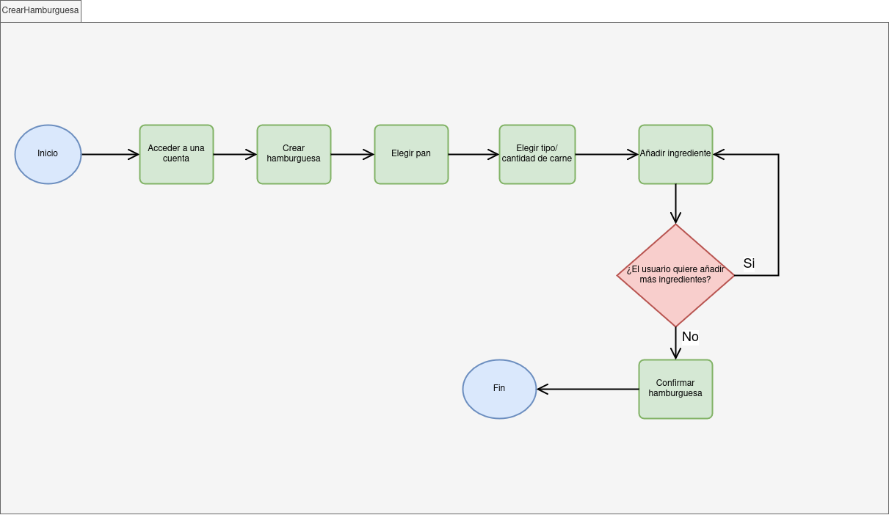

## DIU - Práctica 2: Ideación y Diseño

En esta segunda práctica hemos definido la propuesta de valor y la estructura principal para nuestro proyecto **DarkPatterns**, orientándolo a la personalización de hamburguesas y la optimización de las reservas.

### Ideación 

Como técnica de ideación hemos utilizado un **Mapa de Empatía** para profundizar en el comportamiento y necesidades de nuestros usuarios objetivo, identificando claramente qué piensan, sienten, escuchan, ven, dicen y hacen, así como sus principales frustraciones y motivaciones.

* **Mapa de Empatía:**
.png)

### Propuesta de Valor

Hemos definido nuestra propuesta de valor utilizando el **Scope Canvas**, estableciendo nuestras metas, necesidades del usuario y las funcionalidades clave (features) que debe tener la plataforma para satisfacerlas.

* **Scope Canvas:**
%20(Copy)%20(Copia).png)

### Task Analysis (User / Task Flow)

A continuación, mostramos el análisis de las tareas principales y más críticas para los usuarios en nuestra plataforma. Hemos modelado los siguientes flujos de usuario:

* **Crear Hamburguesa:** Flujo para la personalización y pedido de una hamburguesa.

* **Reservar Mesa:** Flujo optimizado para garantizar una reserva rápida y sin fricciones.

* **Acceder a Cuenta:** Flujo básico de autenticación de usuario.

### Arquitectura de Información

Organización lógica de la información, la navegación y las etiquetas (labelling) que se presentarán al usuario.

* **Sitemap:**

* **Labelling:**
Los términos acordados y su significado se detallan en el documento adjunto: 
[Ver Labelling (PDF)](Labelling.pdf)

### Prototipo Lo-FI Wireframe 

A partir de los flujos de usuario y la arquitectura de la información definidos, hemos esquematizado los bocetos iniciales (Wireframes Lo-Fi) de las pantallas principales del sistema. 

El diseño se ha enfocado en un formato *desktop* (1440px ancho) utilizando una retícula (grid layout) estructurada de 12 columnas. Trabajando en escala de grises y empleando elementos puramente estructurales, nos hemos centrado en asentar la jerarquía visual, la disposición de los datos (alérgenos, precios) y la usabilidad, en lugar del impacto estético.

A continuación se enlazan los documentos con los diseños correspondientes a las pantallas y flujos más representativos de nuestra plataforma:

* **Página Principal (Home):** Diseño inicial de la pantalla de bienvenida.

* **Página de Carta:** Mostrar productos con enfoque en claridad de precios y etiquetas de alérgenos.

* **Personalizador de Hamburguesa:** Interfaz de visualización partida para configurar el plato desde cero.

* **Proceso de Reserva:** Pantalla simplificada para fijar una mesa a través de formulario.

### Conclusiones  

En esta fase de diseño hemos logrado asentar las bases conceptuales y estructurales de nuestra propuesta. Combinando la empatía por el usuario con el análisis centrado en las tareas principales (como reservar o personalizar una hamburguesa), visualizamos un flujo claro de navegación que posteriormente se usará en los Wireframes. La arquitectura de información nos ayuda a dar respuesta directa a las carencias encontradas durante la P1 (como la falta de transparencia en los productos).
