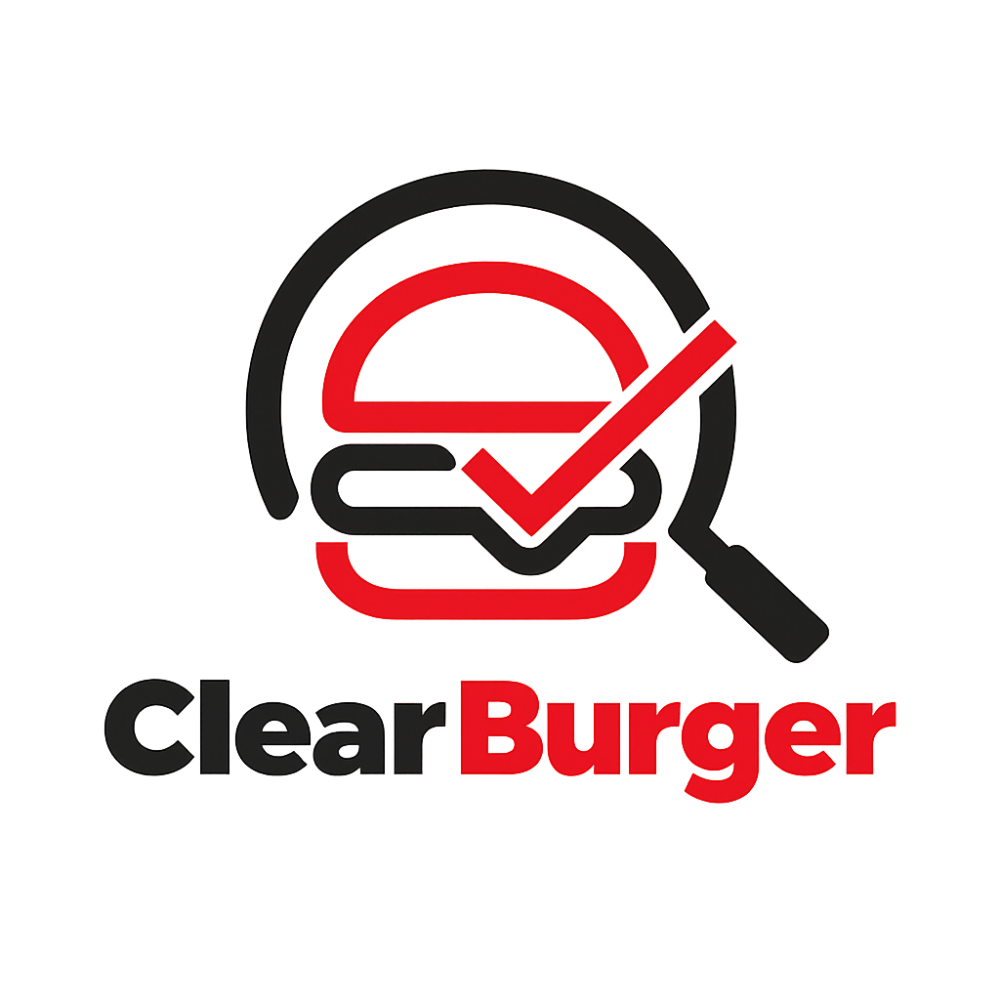

# DIU - Practica 3, entregables

- Moodboard (diseño visual + logotipo) ✅
- Landing Page ✅
- Design System (Atomic Design) ✅
- Mockup: LAYOUT HI-FI *(en progreso)*
- Publicación del Case Study

______________________________________________________

# Moodboard

**Archivo final del Moodboard:** [Descargar/Ver PDF](Moodboard-P3_DarkPatterns.pdf)

**Enlace al Moodboard en Figma:** [Ver Moodboard completo (Figma)](https://www.figma.com/design/eV5CyeyMHPOjrAd9HuXekq/Untitled?node-id=0-1&t=M9fE7HbpVGV4a53N-1)

### 1. Proyecto y Objetivos
**Título:** ClearBurger - Tu hamburguesa, sin sorpresas.

Este proyecto nace para ofrecer una experiencia de pedida y reserva de hamburguesas totalmente honesta, rápida y transparente. Buscamos empoderar al usuario dándole control total sobre la personalización de su pedido, mostrando precios y alérgenos de forma cristalina. El objetivo principal es eliminar la frustración de los "patrones oscuros" habituales en otras aplicaciones de comida a domicilio, demostrando que una buena interfaz puede ser ética y al mismo tiempo rentable.

**Autores:** Roberto González Lugo y Antonio Alcalá-Galiano Sánchez

### 2. Identidad visual y Logotipo

Nuestro logotipo se basa en un estilo urbano e industrial, priorizando en todo momento la legibilidad. Hemos diseñado un isotipo limpio que acompaña a la marca, de trazos gruesos y combinando rojo y negro para transmitir energía, modernidad y solidez.

### 3. UX Writing (Voz y Tono)
**Eslogan principal:** *"El sabor real, sin letras pequeñas."*

Para los textos de la interfaz hemos optado por ser directos, honestos y cercanos, evitando el lenguaje engañoso o la sensación de urgencia artificial (como los típicos mensajes de "¡Reserva ya, solo quedan 2 mesas!").
*   **Voz:** Profesional pero urbana y moderna.
*   **Tono:** Transparente, claro y muy respetuoso con el tiempo del usuario.
*   En la práctica, esto se traduce en botones equitativos (la opción de "Cancelar" tiene la misma visibilidad que la de aceptar) y mensajes francos como "Añade ingredientes (desde +0.50€)".

### 4. Paleta de Colores
Nuestra paleta se inspira en un entorno nocturno y en los tonos clásicos de la comida rápida, ofreciendo un contraste moderno para un *Dark Mode* elegante.
*   **Rojo Carmin (#D92525):** Color de acción principal (CTA) que abre el apetito y denota energía.
*   **Negro Carbón (#1A1A1A):** Color de fondo para estructurar el layout, dando un toque premium.
*   **Gris Acero (#333333 y #8C8C8C):** Tonos neutros para bordes y tipografías desactivadas/secundarias.
*   **Blanco Hueso (#F5F5F5):** Usado en la tipografía sobre fondos oscuros para asegurar la accesibilidad visual.

### 5. Tipografía
Hemos seleccionado un sistema tipográfico sin serifa (Sans-Serif), robusto y altamente legible:
*   **Heading:** *Montserrat* (Bold). Su aspecto geométrico y condensado combina a la perfección con la estética industrial que buscamos, dando muchísima fuerza a los títulos.
*   **Body:** *Inter* (Regular/Medium). Una fuente muy neutra, fundamental para que los listados de ingredientes, alérgenos y precios se lean con claridad en las pantallas.

### 6. Inspiración Visual
Para la parte gráfica nos hemos inspirado en fotografías de hamburguesas sobre fondos oscuros y texturas de madera o ladrillo. La idea es que la interfaz luzca como una aplicación premium apoyada en tarjetas (cards) limpias para facilitar la navegación sin distraer del producto final.

### 7. Enfoque en el Usuario
Nos hemos basado en nuestro Mapa de Empatía (Práctica 2) para enfocar las decisiones de diseño. Atendemos a usuarios jóvenes-adultos acostumbrados a apps de *delivery* que valoran un proceso sin fricciones. Partimos de verbalizaciones reales o latentes que identificamos en la investigación:
* *"Siempre tengo problemas para encontrar los alérgenos, quiero saber qué como sin buscar por todos lados".*
* *"Odio ir a pagar y ver que el precio ha subido mágicamente un 30% por cargos extra preseleccionados".*

---

# Landing Page

**Enlace al Landing Page:** [Ver Landing Page](https://trade-editor-25618488.figma.site)

La Landing Page fue generada mediante **Figma Make** (herramienta de Vibe Coding/Design de Figma), aplicando el lenguaje visual definido en el Moodboard: paleta dark mode, tipografía Montserrat/Inter y tono de voz transparente y directo. El proceso consistió en definir los prompts con el objetivo, el estilo y el contenido clave (CTA principal, beneficios, headline), iterando sobre el resultado para ajustar la jerarquía visual y los colores de marca.

---

# Design System

**Enlace al Design System en Figma:** [Ver Design System completo](https://www.figma.com/design/hSSaOkXlwwd5DqxbSwdTj9/Design-system?node-id=0-1&t=3GDIyxNABywiV3ie-1)

El Design System de ClearBurger está construido siguiendo la metodología **Atomic Design**, partiendo de los tokens visuales base (Foundations) hasta llegar a los organismos completos reutilizables en el Layout Hi-Fi.

## Foundations

Sistema visual base generado con el plugin **Foundation Studio** para Figma. Incluye rampas de color semánticas (Primary, Secondary, Neutrals, Error, Success, Warning), escala tipográfica modular (H1–H5, Paragraph, Small), sistema de sombras, radios de esquina y espaciado basado en rejilla de 8px.

**Dark Mode:**

**Light Mode:**

## Átomos

Componentes mínimos e indivisibles con variantes Figma y Autolayout:

- **Button**: 4 variantes (Primary / Secondary / Disabled / Ghost). Padding 12px vertical / 24px horizontal.
- **Input**: 3 estados (Default / Focus / Error). Padding 12px vertical / 16px horizontal.
- **Badge / Etiqueta de alérgeno**: 3 variantes (Default / Warning / Positive). Padding 4px vertical / 10px horizontal.

## Moléculas

Composiciones de átomos para patrones de interfaz recurrentes:

- **Barra de búsqueda**: 3 estados (Default / Focus / Filled)
- **List item**: 5 variantes simples + 5 variantes con badge de alérgeno
- **Card de producto**: 3 variantes (imagen + nombre + precio + botón Pedir)

## Organismos

- **Navbar**: Logo ClearBurger + navegación principal (Reservar, Sobre nosotros, Carta, Hacer pedido, ¡Crea tu hamburguesa!) + avatar de usuario
- **Footer**: Logo + navegación secundaria + enlaces legales + iconos de redes sociales

---

# Layout Hi-Fi

*(En progreso — se enlazará el prototipo interactivo de Figma al completarse)*

---

## Conclusiones

*(Pendiente de completar al cierre de la práctica)*
