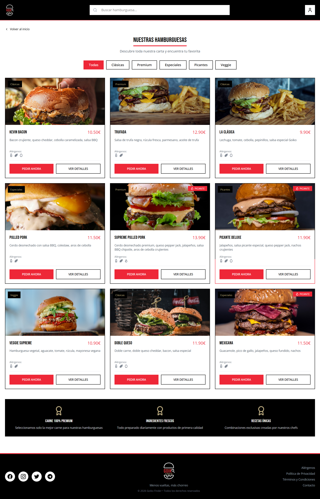
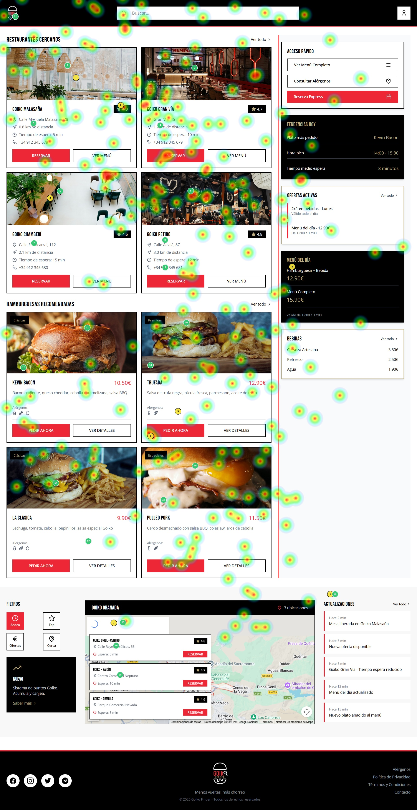
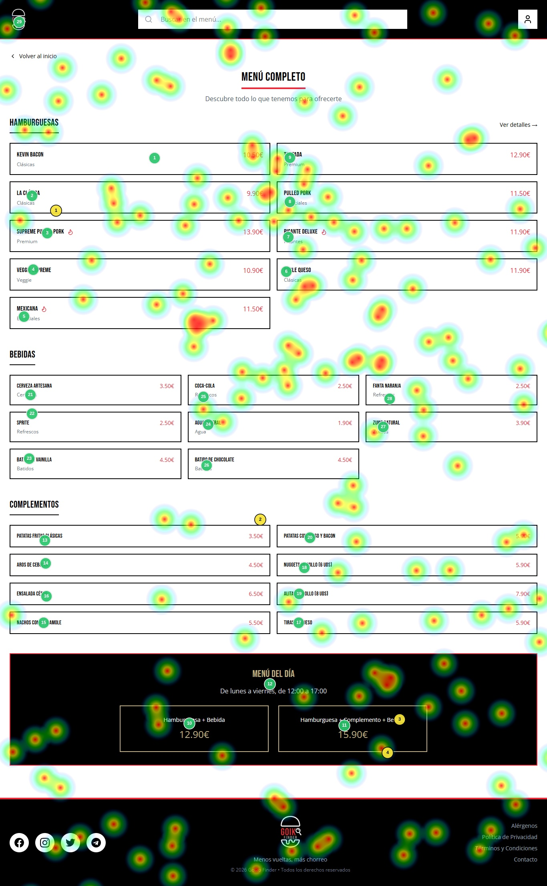
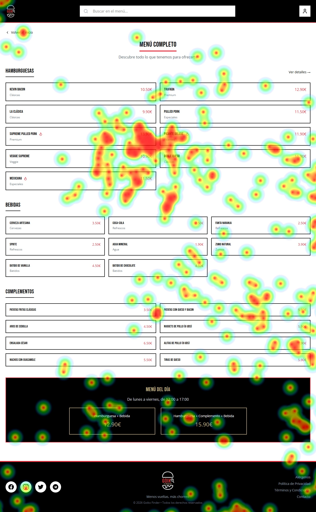
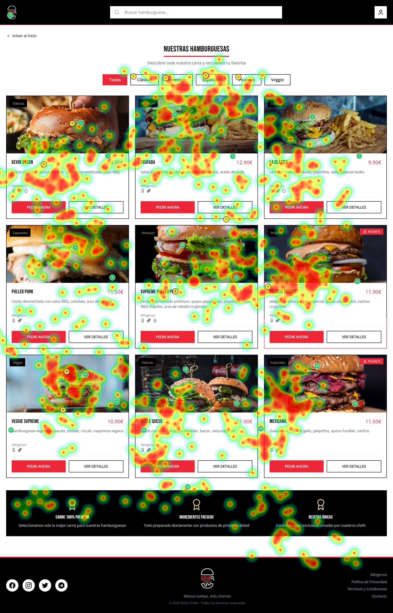

## Practica 5: Exportación + Documentación - entregables 

**RECLUTAMIENTO**

Para realizar esta práctica, por cuestiones de tiempo, hemos podido reunir una muestra de 5 usuarios, de los cuales ha habido 3 usuarios clave a los que les hemos realizado la prueba de Eye Tracking. Los datos de los participantes son:

| ID | Edad | Género | Competencia Digital |
| :---- | :---- | :---- | :---- |
| P1 | 21 | Masculino | Alta |
| P2 | 21 | Masculino | Alta |
| P3 | 52 | Femenino | Media |

Respecto a las condiciones en las que se realiza la prueba de eye tracking, todos los usuarios se han quitado gafas en caso de tenerlas, por lo que todos la han realizado con la cara descubierta. La iluminación ha sido natural, y se ha realizado en un portátil.   
Los dos primeros usuarios son estudiantes de la clase, por lo que están familiarizados con este tipo de pruebas, ya que las están estudiando también. Los otros dos no han participado nunca ni están nada familiarizados. P1, P2 son estudiantes, mientras que P4 podríamos considerar que es un usuario final, ya que es alguien que no tiene conocimientos de informática pero que sí que usa bastante este tipo de páginas web.  
Por otro lado, para realizar el resto de pruebas, los 3 usuarios han evaluado ambos casos, pero 2 de ellos han evaluado primero el B, y el restante ha evaluado primero el A.

**EYE TRACKING CASO B**

Las imágenes que vamos a usar para evaluar el caso B mediante Gaze mapping son las siguientes:

En cuanto a puntos de interés, hemos seleccionado las partes que hemos considerado más importantes en la web por la información que aportan, las cuales son: fotografías de alimentos y lugares, precios, el mapa con los restaurantes, los nombres de cada componente del menú…

Respecto a las acciones que tiene que realizar el usuario, hemos pedido que naveguen por la web como si tuviesen interés por pedir una hamburguesa, y que realicen tareas como buscar el botón de reserva, los alérgenos, los diferentes lugares o las disponibilidad de los establecimientos. De esta manera, tratamos de hacer que investiguen información como los precios, los ingredientes o los locales…

Los resultados del mapa de calor de los diferentes participantes han sido los siguientes:

**P1:**

Podemos observar que este usuario ha mirado toda la web muy por encima, analizando cada detalle y centrándose sobre todo en las cards tanto de hamburguesas como de restaurantes. Es también claro que apenas ha mirado el mapa, por lo que esta función ha pasado desapercibida para él.

**P2:**

Analizando a este usuario nos hemos dado cuenta de que ha mirado sobre todo las fotos, y en algunas casos también ha puesto mucha atención en la información. De este modo, suponemos que este usuario tiende a fijarse en las imágenes y, si le llaman la atención, pasa a leer los detalles del producto o [establecimiento. En](http://establecimiento.En) el menú ha pasado algo parecido, pues se ha centrado en algunas partes muy concretas, en lugar de analizarlo todo.

**P3:**

 Por último tenemos al sujeto P3, el cual como podemos ver ha mirado todo con muchísima atención, tanto imágenes como texto. En el menú también se ha fijado en prácticamente todas las opciones.

En conclusión evaluando los tres casos, podemos concluir en que la gente joven, quizás por estar más familiarizadas con la tecnología, tienden a poner mucha menos atención al contenido y lo miran todo mucho más rápido, centrándose sólo en lo que les interesa. Por su parte, como podemos ver gracias al P3, la gente un poco más mayor y con menos experiencia digital suele poner mucha atención en todos los detalles, ya que no saben exactamente qué es lo importante y qué no. De este modo, creemos que lo más adecuado sería tratar de simplificar un poco el diseño para que se adapte mejor a la gente menos familiarizada, haciendo que tengan menos cosas en las que fijarse y que se destaque claramente lo más importante. Nuestras recomendaciones de mejora serían, en primer lugar, reducir los elementos del grid y hacerlos más grandes, de manera que destaquen más y que la interfaz sea más simple. La descripción de texto y el botón de mostrar detalles son muy correctos, ya que contribuyen a esta simplicidad (pues solo ves los detalles si la hamburguesa tre llama la atención). El menú del lateral derecho también nos parece muy buena idea, ya que proporciona mucha información y de una forma muy rápida y fácil de ver. En segundo lugar, consideramos que el apartado de menú mejoraría bastante si incluyese fotografías que lo hiciesen más visual, ya que al ser sólo texto puede hacerse muy monótono y difícil de entender para algunos usuarios. Por último, nos hemos fijado en que ninguno de los 3 sujetos se ha fijado apenas en el apartado del mapa, por lo que, como es una función bastante importante, podría hacerse más llamativo para atraer más la atención, por ejemplo poniendo pines de un color brillante indicando la ubicación exacta y poniendo la info de los restaurantes en un lugar que no tape el contenido.   
Por otro lado, hemos visto que los usuarios se han fijado de manera correcta en los puntos de interés, si bien como mencionamos antes el mapa (que era uno de ellos) ha sido una zona de silencio en la que apenas se han fijado.

**PRUEBAS Y CUESTIONARIO SUS**

Ahora pasamos a las pruebas de uso de los diseños por parte de los usuarios.  Las tareas que les hemos encargado son las siguientes:  
**\-Caso A (Creador de hamburguesas):** Se le pide al usuario que imagine que va a cenar en Goiko y que quiere crear una hamburguesa que se adapte completamente a sus gustos y alérgenos.  
**\-Caso B (Goiko Finder):** Se le pide al usuario que elija la hamburguesa y el lugar que más le gusten para ir un día a comer.

**Cuestionario SUS Caso A:**

P1:

|  | Preguntas | 1 | 2 | 3 | 4 | 5 |
| :---- | :---- | :---- | :---- | :---- | :---- | :---- |
| 1 | Creo que me gustará visitar con frecuencia este website |  |  |  |  | x |
| 2 | Encontré el website innecesariamente complejo |  | x |  |  |  |
| 3 | Pensé que era fácil utilizar este website |  |  |  |  | x |
| 4 | Creo que necesitaría del apoyo de un experto para recorrer el website |  | x |  |  |  |
| 5 | Encontré las funciones del website bastante bien integradas |  |  |  | x |  |
| 6 | Pensé que había demasiada inconsistencia en el website | x |  |  |  |  |
| 7 | Imagino que la mayoría de las personas aprenderían muy rápidamente a utilizar el website |  |  |  | x |  |
| 8 | Encontré el website muy grande al recorrerlo |  |  | x |  |  |
| 9 | Me sentí muy confiado en el manejo del website |  |  |  | x |  |
| 10 | Necesito aprender muchas cosas antes de manejarse en el website | x |  |  |  |  |

P2: 

|  | Preguntas | 1 | 2 | 3 | 4 | 5 |
| :---- | :---- | :---- | :---- | :---- | :---- | :---- |
| 1 | Creo que me gustará visitar con frecuencia este website |  |  |  |  | x |
| 2 | Encontré el website innecesariamente complejo | x |  |  |  |  |
| 3 | Pensé que era fácil utilizar este website |  |  |  | x |  |
| 4 | Creo que necesitaría del apoyo de un experto para recorrer el website | x |  |  |  |  |
| 5 | Encontré las funciones del website bastante bien integradas |  |  |  | x |  |
| 6 | Pensé que había demasiada inconsistencia en el website | x |  |  |  |  |
| 7 | Imagino que la mayoría de las personas aprenderían muy rápidamente a utilizar el website |  |  |  |  | x |
| 8 | Encontré el website muy grande al recorrerlo |  | x |  |  |  |
| 9 | Me sentí muy confiado en el manejo del website |  |  |  |  | x |
| 10 | Necesito aprender muchas cosas antes de manejarse en el website | x |  |  |  |  |

P3: 

|  | Preguntas | 1 | 2 | 3 | 4 | 5 |
| :---- | :---- | :---- | :---- | :---- | :---- | :---- |
| 1 | Creo que me gustará visitar con frecuencia este website |  |  |  |  | x |
| 2 | Encontré el website innecesariamente complejo |  | x |  |  |  |
| 3 | Pensé que era fácil utilizar este website |  |  | x |  |  |
| 4 | Creo que necesitaría del apoyo de un experto para recorrer el website |  | x |  |  |  |
| 5 | Encontré las funciones del website bastante bien integradas |  |  |  | x |  |
| 6 | Pensé que había demasiada inconsistencia en el website | x |  |  |  |  |
| 7 | Imagino que la mayoría de las personas aprenderían muy rápidamente a utilizar el website |  |  |  | x |  |
| 8 | Encontré el website muy grande al recorrerlo |  |  | x |  |  |
| 9 | Me sentí muy confiado en el manejo del website |  |  |  | x |  |
| 10 | Necesito aprender muchas cosas antes de manejarse en el website |  | x |  |  |  |

| Usuario | Puntuación SUS | Escala linguística |
| :---- | :---- | :---- |
| P1 | 82.5 | Muy buena |
| P2 | 92.5 | Excelente |
| P3 | 75 | Buena |

**Cuestionario SUS Caso B:**

P1:

|  | Preguntas | 1 | 2 | 3 | 4 | 5 |
| :---- | :---- | :---- | :---- | :---- | :---- | :---- |
| 1 | Creo que me gustará visitar con frecuencia este website |  |  |  |  | x |
| 2 | Encontré el website innecesariamente complejo |  | x |  |  |  |
| 3 | Pensé que era fácil utilizar este website |  |  |  |  | x |
| 4 | Creo que necesitaría del apoyo de un experto para recorrer el website | x |  |  |  |  |
| 5 | Encontré las funciones del website bastante bien integradas |  |  | x |  |  |
| 6 | Pensé que había demasiada inconsistencia en el website |  | x |  |  |  |
| 7 | Imagino que la mayoría de las personas aprenderían muy rápidamente a utilizar el website |  |  | x |  |  |
| 8 | Encontré el website muy grande al recorrerlo |  |  |  | x |  |
| 9 | Me sentí muy confiado en el manejo del website |  |  |  | x |  |
| 10 | Necesito aprender muchas cosas antes de manejarse en el website | x |  |  |  |  |

P2: 

|  | Preguntas | 1 | 2 | 3 | 4 | 5 |
| :---- | :---- | :---- | :---- | :---- | :---- | :---- |
| 1 | Creo que me gustará visitar con frecuencia este website |  |  |  |  | x |
| 2 | Encontré el website innecesariamente complejo |  | x |  |  |  |
| 3 | Pensé que era fácil utilizar este website |  |  |  | x |  |
| 4 | Creo que necesitaría del apoyo de un experto para recorrer el website | x |  |  |  |  |
| 5 | Encontré las funciones del website bastante bien integradas |  |  |  | x |  |
| 6 | Pensé que había demasiada inconsistencia en el website | x |  |  |  |  |
| 7 | Imagino que la mayoría de las personas aprenderían muy rápidamente a utilizar el website |  |  | x |  |  |
| 8 | Encontré el website muy grande al recorrerlo |  |  | x |  |  |
| 9 | Me sentí muy confiado en el manejo del website |  |  |  |  | x |
| 10 | Necesito aprender muchas cosas antes de manejarse en el website | x |  |  |  |  |

P3: 

|  | Preguntas | 1 | 2 | 3 | 4 | 5 |
| :---- | :---- | :---- | :---- | :---- | :---- | :---- |
| 1 | Creo que me gustará visitar con frecuencia este website |  |  |  |  | x |
| 2 | Encontré el website innecesariamente complejo |  |  | x |  |  |
| 3 | Pensé que era fácil utilizar este website |  |  | x |  |  |
| 4 | Creo que necesitaría del apoyo de un experto para recorrer el website |  | x |  |  |  |
| 5 | Encontré las funciones del website bastante bien integradas |  |  |  | x |  |
| 6 | Pensé que había demasiada inconsistencia en el website |  | x |  |  |  |
| 7 | Imagino que la mayoría de las personas aprenderían muy rápidamente a utilizar el website |  |  |  | x |  |
| 8 | Encontré el website muy grande al recorrerlo |  |  |  | x |  |
| 9 | Me sentí muy confiado en el manejo del website |  |  |  | x |  |
| 10 | Necesito aprender muchas cosas antes de manejarse en el website |  | x |  |  |  |

| Usuario | Puntuación SUS | Escala linguística |
| :---- | :---- | :---- |
| P1 | 75 | Buena |
| P2 | 82.5 | Muy buena |
| P3 | 67.5 | Buena |

**A/B TESTING**

Realizaremos las mismas pruebas que en el apartado anterior:

**Caso A:**

| Usuario | Éxito | Tiempo |
| :---- | :---- | :---- |
| P1 | Sí | 45s |
| P2 | Sí | 51s |
| P3 | Sí | 1min 10s |

**Caso B:**

| Usuario | Éxito | Tiempo |
| :---- | :---- | :---- |
| P1 | Sí | 25s |
| P2 | Sí | 32ss |
| P3 | Sí | 47s |

Podemos observar que ambas webs están lo suficientemente bien diseñadas como para que los usuarios consigan realizar lo que se les pide. Se puede apreciar que los tiempos del caso B son bastante más rápidos, pero creemos que esto ha sido porque la prueba del caso A es algo más compleja y larga.

**USABILITY REPORT DE B**

Evaluación de usabilidad del proyecto Goiko Finder

Enlace Github: [https://github.com/DIUGrupoColesterMax/UX\_CaseStudyColesterMax](https://github.com/DIUGrupoColesterMax/UX_CaseStudyColesterMax)

**RESUMEN EJECUTIVO (Executive Summary)**

En este análisis hermanos evaluado la propuesta de Goiko Finder, cuya funcionalidad se basa en simplificar la navegación por la web de goiko y hacer mucho más clara y rápida.   
Los principales aspectos a evaluar han sido la claridad de la web por parte de usuarios de diferente edad y nivel de familiarización con las tecnologías, así como la facilidad de uso de su interfaz.  
Para ello, los usuarios han realizado diversas pruebas. La primera de ellas ha sido el Gaze Mapping, gracias a la cual hemos podido ver que aspectos son los que más llama la atención de la web; y si es fácil encontrar y acceder a las funcionalidades más básicas e importantes.   
Las siguientes pruebas han consistido en pedirle a los usuarios que realicen diversas acciones, pidiéndoles posteriormente que rellenen un cuestionario SUS para poder medir la facilidad de uso y la experiencia de los usuarios al utilizar la web. Además, también se ha realizado la prueba de A/B testing  cronometrando a los sujetos al realizar estas tareas, para tener una idea acerca del tiempo medio que se tarda en realizar las acciones pedidas.

Como puntos críticos hemos encontrado, en primer lugar, que el grid de hamburguesas y restaurantes tiene muchos elementos, lo cual puede dificultar la experiencia a los usuarios con menos entendimiento de las tecnologías. Por otro lado, el apartado de menú lo hemos encontrado muy monótono al estar formado por muchos cuadros de texto sin ninguna imagen o dibujo de los productos. Por último, en las pruebas nos hemos dado cuenta de que los usuarios apenas han mirado el mapa de ubicaciones de los restaurantes, por lo que se debería de tratar de hacer más llamativo.

Los resultados de los cuestionarios SUS han sido bastante positivos, pues ha habido una puntuación media de 75, lo cual nos dice que la experiencia y la facilidad de uso que han tenido estos usuarios al utilizar la web ha sido bastante alta, por lo que el diseño es bastante aceptable.

**Auditoría de Accesibilidad**  
Los principales aspectos positivos que hemos encontrado han sido:

\-Contraste de texto: El texto negro sobre fondo blanco ofrece una legibilidad muy alta que cumple con el ratio de contraste exigido por la WCAG (mínimo 4.5:1 para texto normal).

 \-Iconos para apoyo: Los platos picantes incluyen un icono de una llama junto al texto. Esto cumple con la norma de no usar el color como único medio para transmitir información.

Por el contrario, hemos apreciado que el contraste en el apartado de menú del día hay texto gris y dorado sobre un fondo negro texturizado, lo cual no alcanza el ratio de contraste requerido para usuarios con baja visión.

**Conclusiones y Recomendaciones (Actionable Insights)**

| Prioridad | Hallazgo | Recomendación de mejora |
| :---- | :---- | :---- |
| Alta | El contraste en el apartado de menú del día no es correcto para usuarios con baja visión | Cambiar el color de las letras o del fondo para que el contraste mejore y pueda ser visto de mejor manera. Un ejemplo sería poner el texto de color blanco, ya que negro y blanco hacen que el apartado sea bastante legible |
| Alta | El mapa con las ubicaciones de restaurantes es una zona de silencio que los usuarios apenas han mirado, cuando debería ser algo importante en la web | Retirar el nombre e información de los restaurantes a otra zona que no tape el mapa, y poner marcas llamativas con la ubicación de los restaurantes. Otra solución podría ser mover el apartado a otra zona en la que se vea más claramente, como la barra del lateral derecho |
| Media | El grid de hamburguesas y restaurantes tiene mucho contenido, lo cual lo puede hacer muy complejo y difícil de entender para algunos usuarios.  | Simplificar dicho grid para que solo tenga dos columnas, y hacer las imágenes más grandes para que la interfaz sea más simple, visual y fácil de entender  |
| Media | El menú es muy monótono al estar formado sólo por texto, lo cual hace que leer todos sus elementos sea una tarea larga y aburrida, y que no se entienda bien | Añadir imágenes de los productos al lado del nombre, y hacer los elementos un poco más grandes para que se vean mejor y la interfaz quede más visual. |

