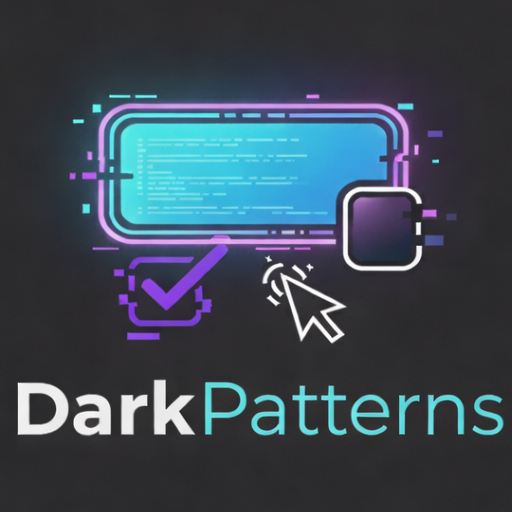
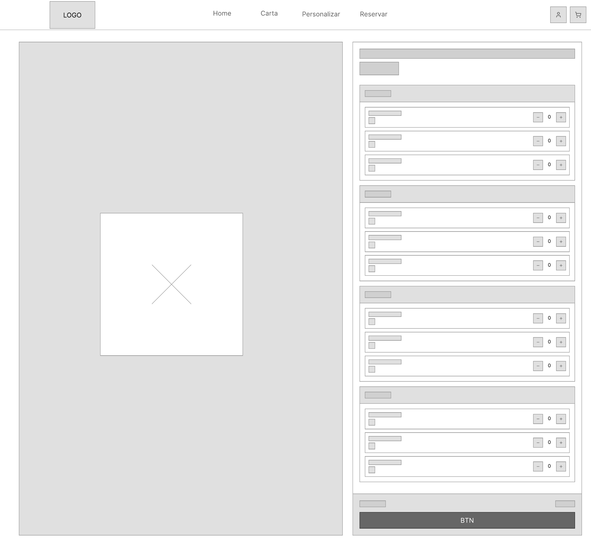
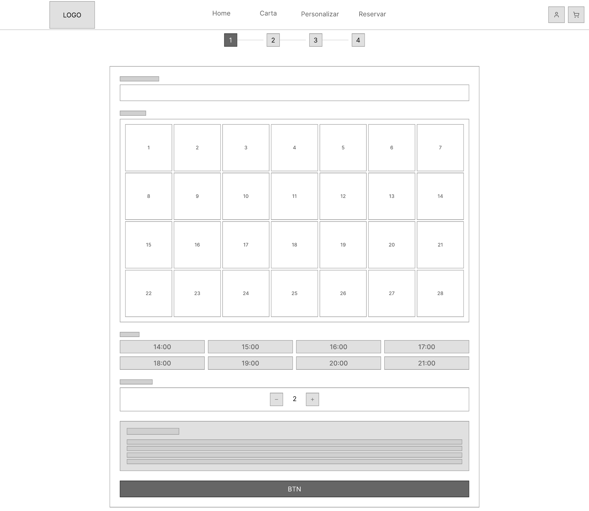
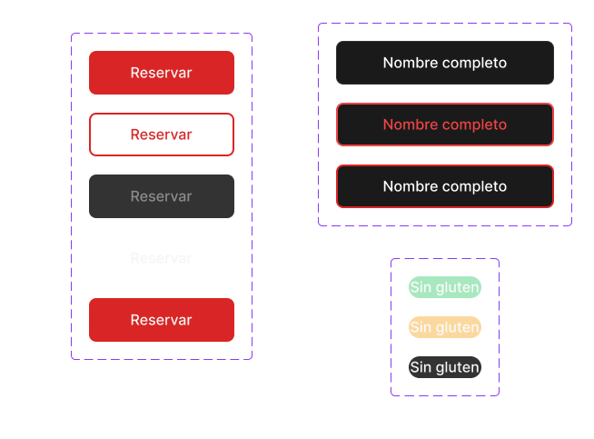
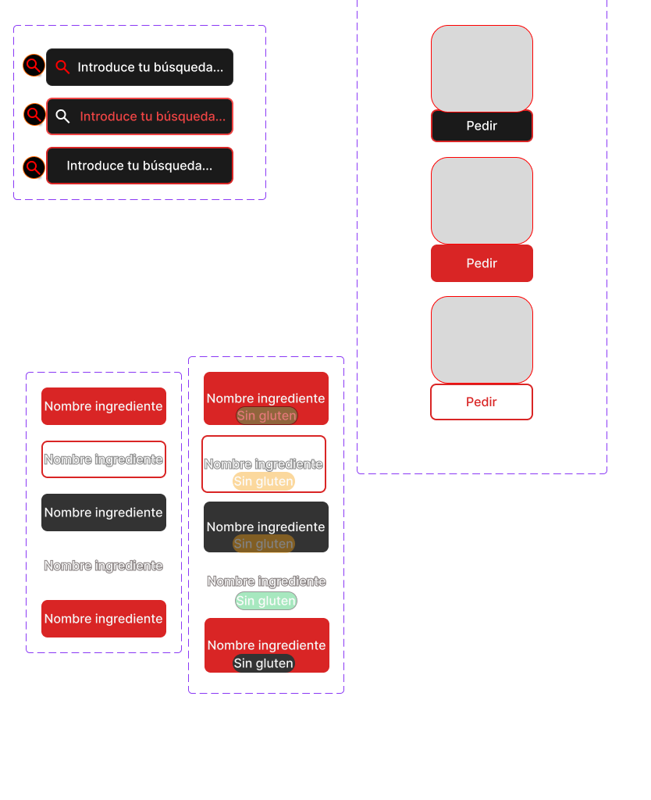

# DIU26
Prácticas Diseño Interfaces de Usuario (Tema: .... ) 

* [Guiones de prácticas](GuionesPracticas/)
* [Guía para crea tu Case Study](Guia_CaseStudy.md)
* Sala de la Fama [DIU Hall of fame](https://github.com/mgea/DIU/tree/master/hall_of_fame) donde se pueden encontrar Case Study destacados de otros años.
* [Recursos/plantillas en figma](https://www.figma.com/design/BN2IR0q2clOSplfMmalh9K/DIU_Toolkit_Framework--2026-)

Actualizado: 14/01/2026

## Paso 0 My UX-Case Study
 
-----

Grupo: DIU3_DarkPatterns  
Curso: 2025/26  
Repositorio del proyecto: [DIU3-DarkPatterns/UX_CaseStudy](https://github.com/DIU3-DarkPatterns/UX_CaseStudy)

Nombre del Proyecto: DarkPatterns

Descripción: Case Study de diseño UX/UI orientado a la evaluación de usabilidad y análisis de experiencia de usuario en el contexto de restauración digital.

Logotipo:

Miembros y nombre del equipo:
 * :bust_in_silhouette: Roberto González Lugo - [@roberlks](https://github.com/roberlks)
 * :bust_in_silhouette: Antonio Alcalá-Galiano Sánchez - [@aags25](https://github.com/aags25)

----- 

 

# Proceso de Diseño 

 

## Paso 1. UX User & Desk Research & Analisis 

Caso de estudio trabajado en P1: **DIUP1_DarkPatterns (Goiko)**.
- [Readme especifico de la P1](P1/DIUP1/README.md)

### 1.a User Research Plan

-----

Se estableció un plan de investigación centrado en la usabilidad de Goiko, combinando técnicas cualitativas (entrevistas) y cuantitativas (pruebas de tareas cronometradas), con foco en tres acciones clave: reserva, consulta de ubicaciones y acceso a información de precio/ingredientes/alérgenos.

Documento principal:
- [User Research Plan completo](P1/DIUP1/UserResearchPlan/UserResearchPlan.md)

### 1.b Competitive Analysis

-----

Se comparó Goiko con dos competidores directos del mismo segmento:
- Sancho Casual Burger
- Capital Burger

Conclusiones principales del análisis:
- Goiko destaca por claridad y orden en la presentación de información.
- Existe una brecha relevante en visibilidad de precios frente a la competencia.
- Se detectan oportunidades en ambientación visual y jerarquía comercial de contenido.

Documentos:
- [Competitive Analysis (análisis argumentado)](P1/DIUP1/CompetitiveAnalysis/competitive_analysis_goiko.md)
- [Competitive Analysis (tabla comparativa)](P1/DIUP1/CompetitiveAnalysis/Competitor_Analysis.pdf)

### 1.c Personas

-----

Se definieron dos perfiles representativos para evaluar necesidades y fricciones de uso:
- **María García**: perfil planificador, sensible a información de alérgenos y precios.
- **Javier López**: perfil dinámico, orientado a rapidez en pedido/reserva y experiencia móvil fluida.

Documentos:
- [Persona de María García + Journey Map](P1/DIUP1/Personas%20%26%20User%20Journey%20Maps/Persona%20%26%20User%20Journey%20Map_MariaGarcia%28goiko%29.pdf)
- [Persona de Javier López + Journey Map](P1/DIUP1/Personas%20%26%20User%20Journey%20Maps/Persona%20%26%20User%20Journey%20Map_JavierLopez.pdf)

### 1.d User Journey Map

----

Los journey maps modelan dos objetivos de uso diferentes:
- Toma de decisión informada previa a reserva (usuario planificador).
- Ejecución rápida de pedido/reserva en contexto social y móvil (usuario ágil).

Ambos recorridos permiten detectar puntos de fricción en información crítica, tiempos de decisión y pasos operativos.

Documentos:
- [Journey de María García](P1/DIUP1/Personas%20%26%20User%20Journey%20Maps/Persona%20%26%20User%20Journey%20Map_MariaGarcia%28goiko%29.pdf)
- [Journey de Javier López](P1/DIUP1/Personas%20%26%20User%20Journey%20Maps/Persona%20%26%20User%20Journey%20Map_JavierLopez.pdf)

### 1.e Usability Review

----

Se aplicó una revisión heurística estructurada (UX for the Masses) para valorar navegación, claridad, contenidos y soporte de tareas principales.

- **URL evaluada**: https://www.goiko.com/es/
- **Valoración obtenida**: **70/100 (Good)**
- **Fortalezas**: claridad visual y estructura base de navegación.
- **Debilidades**: visibilidad de precios/alérgenos, fluidez móvil y simplificación de acciones de conversión.

Documento:
- [Usability Review Report](P1/DIUP1/UsabilityReview/Usability-review.pdf)

### 1.f Briefing

Como cierre de P1 se elaboró un briefing ejecutivo que sintetiza hallazgos, prioridades y líneas de mejora para la siguiente fase de diseño.

Documento:
- [Briefing ejecutivo](P1/DIUP1/Briefing/briefing.md)

 

## Paso 2. UX Design  

- [Readme específico y completo de la P2](P2/README.md)

### 2.a Reframing / IDEACION: Empathy Map 
 
----

Para abordar el diseño y entender mejor las necesidades latentes identificadas en la Práctica 1 (como la falta de visibilidad en precios y alérgenos), elaboramos un Mapa de Empatía. Esta herramienta nos permitió identificar los principales *pains* (frustraciones) y *gains* (alegrías/expectativas) de nuestro usuario objetivo cuando interactúa con un servicio de restaurante online.

**Problema e Hipótesis:** La competencia carece de una configuración transparente de productos y procesos ágiles de reserva. Nuestra hipótesis es que simplificando los flujos de "Crear mi propia hamburguesa", manteniendo visibilidad total de ingredientes y precios en tiempo real, aumentará significativamente la conversión y la satisfacción del usuario de perfil planificador.

.png)

### 2.b ScopeCanvas

----

Hemos aterrizado nuestra propuesta de valor "DarkPatterns" a través de un Scope Canvas, delimitando claramente nuestros objetivos (transparencia y agilidad), las necesidades de los usuarios y las funcionalidades o *features* clave requeridas (personalizador dinámico, reserva simplificada en pocos pasos, etiquetado de alérgenos).

%20(Copy)%20(Copia).png)

### 2.c User Flow (Task Analysis)
 
-----

Hemos analizado y modelado los flujos de tareas más críticos para asegurar que la navegación sea intuitiva y libre de fricciones. Se definieron tres *User Flows* principales:

1. **Crear Hamburguesa:** Flujo *core* para personalizar un producto desde cero y añadirlo al pedido. [Ver Flujo](P2/CrearHamburguesa.png)
2. **Reservar Mesa:** Flujo secuencial y ágil para asegurar mesa sin dudas ni distracciones. [Ver Flujo](P2/ReservarMesa.png)
3. **Acceder a Cuenta:** Flujo clásico de registro/login de usuario. [Ver Flujo](P2/AccederaCuenta.png)

### 2.d IA: Sitemap + Labelling 
 
----

Definimos la estructura de la aplicación y la nomenclatura precisa con el objetivo de hablar el idioma del usuario y organizar la información lógicamente.

**Sitemap:**

**Labelling:**
La tabla detallando el significado de cada término en la navegación ha sido documentada en el siguiente archivo:
- [Documento de Labelling (PDF)](P2/Labelling.pdf)

### 2.e Wireframes (Lo-Fi)
 
-----

Para validar los flujos anteriores, diseñamos wireframes de baja fidelidad (Lo-Fi) para entorno Web Desktop (1440px), utilizando una retícula estructurada de 12 columnas. 

El objetivo ha sido definir la jerarquía visual de los componentes clave (precios interactivos, personalizador, filtros por alérgenos). Se diseñaron estas pantallas principales:

- **Home:** 

- **Carta de Productos:** 

- **Personalizador de Hamburguesa (Pantalla Clave):** 

- **Proceso de Reservas:** 

Se pueden visualizar directamente las pantallas en el [documento interno de la P2](P2/README.md).

 

## Paso 3. Mi UX-Case Study (diseño)

- [Readme específico y completo de la P3](P3/readme.md)

### 3.a Moodboard

-----

Diseño visual completo de la identidad de **ClearBurger**, realizado en Figma. El Moodboard define el lenguaje visual del proyecto: paleta dark mode (Rojo Carmín #D92525, Negro Carbón #1A1A1A, Blanco Hueso #F5F5F5), tipografía Montserrat Bold (headings) + Inter (body), estética urbana/industrial con fotografías de producto sobre fondos oscuros.

El logotipo es un imagotipo de trazos gruesos, combinando rojo y negro para transmitir energía y modernidad. El formato del Moodboard está optimizado para pantalla y presentación; para uso en redes sociales como Instagram requeriría adaptación a formato cuadrado (1:1) o vertical (4:5).

Documentos:
- [Ver Moodboard en Figma](https://www.figma.com/design/eV5CyeyMHPOjrAd9HuXekq/Untitled?node-id=0-1&t=M9fE7HbpVGV4a53N-1)
- [Descargar Moodboard PDF](P3/Moodboard-P3_DarkPatterns.pdf)

### 3.b Landing Page

----

Landing Page de **ClearBurger** generada mediante **Figma Make** (Vibe Coding/Design), aplicando el sistema visual del Moodboard. El proceso de generación se basó en prompts iterativos especificando el objetivo (restaurante sin dark patterns), el estilo visual (dark mode, rojo/negro) y la estructura de contenido (headline + beneficios + CTA). La página destaca los tres valores diferenciales: precios transparentes, alérgenos siempre visibles y sin urgencia artificial.

- [Ver Landing Page publicada](https://trade-editor-25618488.figma.site)

### 3.c Lenguaje Visual — Design System

----

Design System ligero construido con metodología **Atomic Design** en Figma. Generado con el plugin **Foundation Studio** para los tokens base y desarrollado manualmente con variantes y Autolayout para los componentes.

**Decisiones de diseño clave:**
- Sistema de color semántico con tokens nombrados (Primary, Neutrals, Feedback) para integración futura con Tailwind CSS.
- Escala tipográfica modular basada en 8px: Montserrat para H1–H5, Inter para Paragraph y Small.
- Componentes con variantes Figma: Button (4), Input (3), Badge (3), SearchBar (3), ListItem (10), Card (3), Navbar y Footer.
- Autolayout en todos los componentes para comportamiento responsive.

- [Ver Design System en Figma](https://www.figma.com/design/hSSaOkXlwwd5DqxbSwdTj9/Design-system?node-id=0-1&t=3GDIyxNABywiV3ie-1)

### 3.d Layout Hi-Fi

----

*(En progreso — prototipo interactivo en Figma con las pantallas principales: Home, Carta, Customizar hamburguesa y Reservar mesa, conectadas con transiciones simuladas. Se enlazará al completarse.)*

### 3.e Briefing

*(Pendiente — descripción del proceso de diseño, herramientas IA utilizadas y su efectividad, conclusiones del equipo sobre la práctica.)*

 

## Paso 4. Pruebas de Evaluación 

### 4.a Reclutamiento de usuarios 

-----

>>> Breve descripción del caso asignado (llamado Caso-B) con enlace al repositorio Github
>>> Tabla y asignación de personas ficticias (o reales) a las pruebas. Exprese las ideas de posibles situaciones conflictivas de esa persona en las propuestas evaluadas. Mínimo 4 usuarios: asigne 2 al Caso A y 2 al caso B.

| Usuarios | Sexo/Edad     | Ocupación   |  Exp.TIC    | Personalidad | Plataforma | Caso
| ------------- | -------- | ----------- | ----------- | -----------  | ---------- | ----
| User1's name  | H / 18   | Estudiante  | Media       | Introvertido | Web.       | A 
| User2's name  | H / 18   | Estudiante  | Media       | Timido       | Web        | A 
| User3's name  | M / 35   | Abogado     | Baja        | Emocional    | móvil      | B 
| User4's name  | H / 18   | Estudiante  | Media       | Racional     | Web        | B 

### 4.b Diseño de las pruebas 
 
-----

>>> Planifique qué pruebas se van a desarrollar. ¿En qué consisten? ¿Se hará uso del checklist de la P1?

### 4.c Cuestionario SUS
 
----

>>> Como uno de los test para la prueba A/B testing, usaremos el **Cuestionario SUS** que permite valorar la satisfacción de cada usuario con el diseño utilizado (casos A o B). Para calcular la valoración numérica y la etiqueta linguistica resultante usamos la [hoja de cálculo](https://github.com/mgea/DIU19/blob/master/Cuestionario%20SUS%20DIU.xlsx). Previamente conozca en qué consiste la escala SUS y cómo se interpretan sus resultados
http://usabilitygeek.com/how-to-use-the-system-usability-scale-sus-to-evaluate-the-usability-of-your-website/)
Para más información, consultar aquí sobre la [metodología SUS](https://cui.unige.ch/isi/icle-wiki/_media/ipm:test-suschapt.pdf)
>>> Adjuntar en la carpeta P4/ el excel resultante y describa aquí la valoración personal de los resultados 

### 4.d A/B Testing
 
-----

>>> Los resultados de un A/B testing con 3 pruebas y 2 casos o alternativas daría como resultado una tabla de 3 filas y 2 columnas, además de un resultado agregado global. Especifique con claridad el resultado: qué caso es más usable, A o B?

### 4.e Aplicación del método Eye Tracking 

----

>>> Indica cómo se diseña el experimento y se reclutan los usuarios. Explica la herramienta / uso de gazerecorder.com u otra similar. Aplíquese únicamente al caso B.

  
>>> Cambiar esta img por una de vuestro experimento. El recurso deberá estar subido a la carpeta P4/  

>>> gazerecorder en versión de pruebas puede estar limitada a 3 usuarios para generar mapa de calor (crédito > 0 para que funcione) 

### 4.f Usability Report de B
 
-----

>>> Añadir report de usabilidad para práctica B (la de los compañeros) aportando resultados y valoración de cada debilidad de usabilidad. 
>>> Enlazar aqui con el archivo subido a P4/ que indica qué equipo evalua a qué otro equipo.

>>> Complementad el Case Study en su Paso 4 con una Valoración personal del equipo sobre esta tarea

 

## Paso 5. Exportación y Documentación 

### 5.a Exportación a HTML/React
 
----

>>> Breve descripción de esta tarea. Las evidencias de este paso quedan subidas a P5/

### 5.b Documentación con Storybook

----

>>> Breve descripción de esta tarea. Las evidencias de este paso quedan subidas a P5/

 

## Conclusiones finales & Valoración de las prácticas

>>> Opinión FINAL del proceso de desarrollo de diseño siguiendo metodología UX y valoración (positiva /negativa) de los resultados obtenidos. ¿Qué se puede mejorar? Recuerda que este tipo de texto se debe eliminar del template que se os proporciona 

