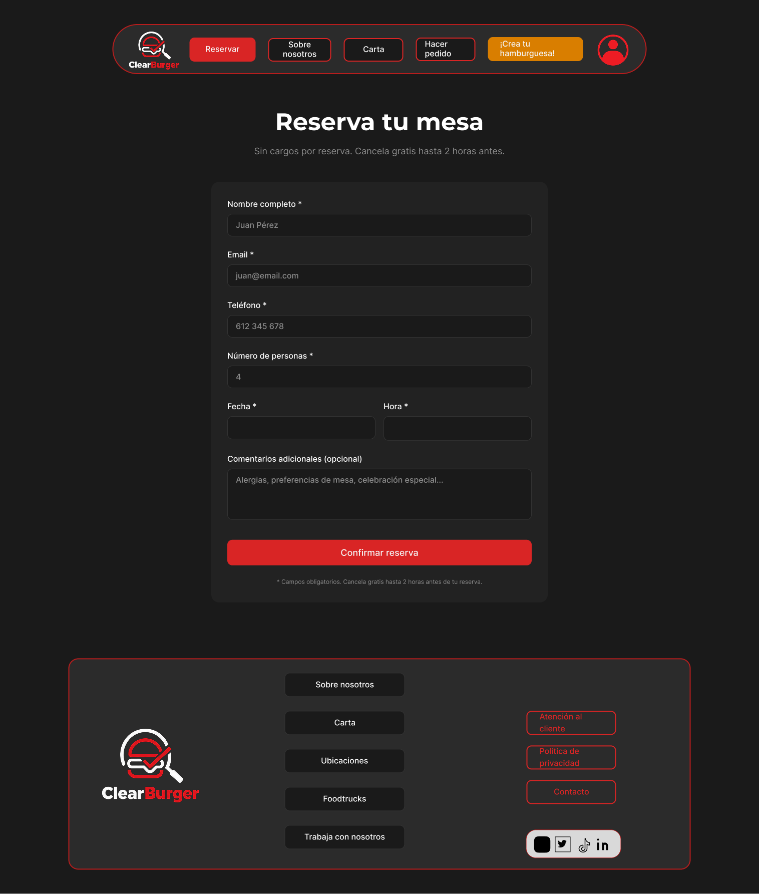

# DIU26
Prácticas Diseño Interfaces de Usuario (Tema: .... ) 

* [Guiones de prácticas](GuionesPracticas/)
* [Guía para crea tu Case Study](Guia_CaseStudy.md)
* Sala de la Fama [DIU Hall of fame](https://github.com/mgea/DIU/tree/master/hall_of_fame) donde se pueden encontrar Case Study destacados de otros años.
* [Recursos/plantillas en figma](https://www.figma.com/design/BN2IR0q2clOSplfMmalh9K/DIU_Toolkit_Framework--2026-)

Actualizado: 14/01/2026

## Paso 0 My UX-Case Study
 
-----

Grupo: DIU3_DarkPatterns  
Curso: 2025/26  
Repositorio del proyecto: [DIU3-DarkPatterns/UX_CaseStudy](https://github.com/DIU3-DarkPatterns/UX_CaseStudy)

Nombre del Proyecto: DarkPatterns

Descripción: Case Study de diseño UX/UI orientado a la evaluación de usabilidad y análisis de experiencia de usuario en el contexto de restauración digital.

Logotipo:

Nuestra WEB: [clearburger-diu3.surge.sh](https://clearburger-diu3.surge.sh)

Miembros y nombre del equipo:
 * :bust_in_silhouette: Roberto González Lugo - [@roberlks](https://github.com/roberlks)
 * :bust_in_silhouette: Antonio Alcalá-Galiano Sánchez - [@aags25](https://github.com/aags25)

----- 

 

# Proceso de Diseño 

 

## Paso 1. UX User & Desk Research & Analisis 

Caso de estudio trabajado en P1: **DIUP1_DarkPatterns (Goiko)**.
- [Readme especifico de la P1](P1/DIUP1/README.md)

### 1.a User Research Plan

-----

Se estableció un plan de investigación centrado en la usabilidad de Goiko, combinando técnicas cualitativas (entrevistas) y cuantitativas (pruebas de tareas cronometradas), con foco en tres acciones clave: reserva, consulta de ubicaciones y acceso a información de precio/ingredientes/alérgenos.

Documento principal:
- [User Research Plan completo](P1/DIUP1/UserResearchPlan/UserResearchPlan.md)

### 1.b Competitive Analysis

-----

Se comparó Goiko con dos competidores directos del mismo segmento:
- Sancho Casual Burger
- Capital Burger

Conclusiones principales del análisis:
- Goiko destaca por claridad y orden en la presentación de información.
- Existe una brecha relevante en visibilidad de precios frente a la competencia.
- Se detectan oportunidades en ambientación visual y jerarquía comercial de contenido.

Documentos:
- [Competitive Analysis (análisis argumentado)](P1/DIUP1/CompetitiveAnalysis/competitive_analysis_goiko.md)
- [Competitive Analysis (tabla comparativa)](P1/DIUP1/CompetitiveAnalysis/Competitor_Analysis.pdf)

### 1.c Personas

-----

Se definieron dos perfiles representativos para evaluar necesidades y fricciones de uso:
- **María García**: perfil planificador, sensible a información de alérgenos y precios.
- **Javier López**: perfil dinámico, orientado a rapidez en pedido/reserva y experiencia móvil fluida.

Documentos:
- [Persona de María García + Journey Map](P1/DIUP1/Personas%20%26%20User%20Journey%20Maps/Persona%20%26%20User%20Journey%20Map_MariaGarcia%28goiko%29.pdf)
- [Persona de Javier López + Journey Map](P1/DIUP1/Personas%20%26%20User%20Journey%20Maps/Persona%20%26%20User%20Journey%20Map_JavierLopez.pdf)

### 1.d User Journey Map

----

Los journey maps modelan dos objetivos de uso diferentes:
- Toma de decisión informada previa a reserva (usuario planificador).
- Ejecución rápida de pedido/reserva en contexto social y móvil (usuario ágil).

Ambos recorridos permiten detectar puntos de fricción en información crítica, tiempos de decisión y pasos operativos.

Documentos:
- [Journey de María García](P1/DIUP1/Personas%20%26%20User%20Journey%20Maps/Persona%20%26%20User%20Journey%20Map_MariaGarcia%28goiko%29.pdf)
- [Journey de Javier López](P1/DIUP1/Personas%20%26%20User%20Journey%20Maps/Persona%20%26%20User%20Journey%20Map_JavierLopez.pdf)

### 1.e Usability Review

----

Se aplicó una revisión heurística estructurada (UX for the Masses) para valorar navegación, claridad, contenidos y soporte de tareas principales.

- **URL evaluada**: https://www.goiko.com/es/
- **Valoración obtenida**: **70/100 (Good)**
- **Fortalezas**: claridad visual y estructura base de navegación.
- **Debilidades**: visibilidad de precios/alérgenos, fluidez móvil y simplificación de acciones de conversión.

Documento:
- [Usability Review Report](P1/DIUP1/UsabilityReview/Usability-review.pdf)

### 1.f Briefing

Como cierre de P1 se elaboró un briefing ejecutivo que sintetiza hallazgos, prioridades y líneas de mejora para la siguiente fase de diseño.

Documento:
- [Briefing ejecutivo](P1/DIUP1/Briefing/briefing.md)

 

## Paso 2. UX Design  

- [Readme específico y completo de la P2](P2/README.md)

### 2.a Reframing / IDEACION: Empathy Map 
 
----

Para abordar el diseño y entender mejor las necesidades latentes identificadas en la Práctica 1 (como la falta de visibilidad en precios y alérgenos), elaboramos un Mapa de Empatía. Esta herramienta nos permitió identificar los principales *pains* (frustraciones) y *gains* (alegrías/expectativas) de nuestro usuario objetivo cuando interactúa con un servicio de restaurante online.

**Problema e Hipótesis:** La competencia carece de una configuración transparente de productos y procesos ágiles de reserva. Nuestra hipótesis es que simplificando los flujos de "Crear mi propia hamburguesa", manteniendo visibilidad total de ingredientes y precios en tiempo real, aumentará significativamente la conversión y la satisfacción del usuario de perfil planificador.

.png)

### 2.b ScopeCanvas

----

Hemos aterrizado nuestra propuesta de valor "DarkPatterns" a través de un Scope Canvas, delimitando claramente nuestros objetivos (transparencia y agilidad), las necesidades de los usuarios y las funcionalidades o *features* clave requeridas (personalizador dinámico, reserva simplificada en pocos pasos, etiquetado de alérgenos).

%20(Copy)%20(Copia).png)

### 2.c User Flow (Task Analysis)
 
-----

Hemos analizado y modelado los flujos de tareas más críticos para asegurar que la navegación sea intuitiva y libre de fricciones. Se definieron tres *User Flows* principales:

1. **Crear Hamburguesa:** Flujo *core* para personalizar un producto desde cero y añadirlo al pedido. [Ver Flujo](P2/CrearHamburguesa.png)
2. **Reservar Mesa:** Flujo secuencial y ágil para asegurar mesa sin dudas ni distracciones. [Ver Flujo](P2/ReservarMesa.png)
3. **Acceder a Cuenta:** Flujo clásico de registro/login de usuario. [Ver Flujo](P2/AccederaCuenta.png)

### 2.d IA: Sitemap + Labelling 
 
----

Definimos la estructura de la aplicación y la nomenclatura precisa con el objetivo de hablar el idioma del usuario y organizar la información lógicamente.

**Sitemap:**

**Labelling:**
La tabla detallando el significado de cada término en la navegación ha sido documentada en el siguiente archivo:
- [Documento de Labelling (PDF)](P2/Labelling.pdf)

### 2.e Wireframes (Lo-Fi)
 
-----

Para validar los flujos anteriores, diseñamos wireframes de baja fidelidad (Lo-Fi) para entorno Web Desktop (1440px), utilizando una retícula estructurada de 12 columnas. 

El objetivo ha sido definir la jerarquía visual de los componentes clave (precios interactivos, personalizador, filtros por alérgenos). Se diseñaron estas pantallas principales:

- **Home:** 

- **Carta de Productos:** 

- **Personalizador de Hamburguesa (Pantalla Clave):** 

- **Proceso de Reservas:** 

Se pueden visualizar directamente las pantallas en el [documento interno de la P2](P2/README.md).

 

## Paso 3. Mi UX-Case Study (diseño)

- [Readme específico y completo de la P3](P3/readme.md)

### 3.a Moodboard

-----

Diseño visual completo de la identidad de **ClearBurger**, realizado en Figma. El Moodboard define el lenguaje visual del proyecto: paleta dark mode (Rojo Carmín #D92525, Negro Carbón #1A1A1A, Blanco Hueso #F5F5F5), tipografía Montserrat Bold (headings) + Inter (body), estética urbana/industrial con fotografías de producto sobre fondos oscuros.

El logotipo es un imagotipo de trazos gruesos, combinando rojo y negro para transmitir energía y modernidad. El formato del Moodboard está optimizado para pantalla y presentación; para uso en redes sociales como Instagram requeriría adaptación a formato cuadrado (1:1) o vertical (4:5).

Documentos:
- [Ver Moodboard en Figma](https://www.figma.com/design/eV5CyeyMHPOjrAd9HuXekq/Untitled?node-id=0-1&t=M9fE7HbpVGV4a53N-1)
- [Descargar Moodboard PDF](P3/Moodboard-P3_DarkPatterns.pdf)

### 3.b Landing Page

----

Landing Page de **ClearBurger** generada mediante **Figma Make** (Vibe Coding/Design), aplicando el sistema visual del Moodboard. El proceso de generación se basó en prompts iterativos especificando el objetivo (restaurante sin dark patterns), el estilo visual (dark mode, rojo/negro) y la estructura de contenido (headline + beneficios + CTA). La página destaca los tres valores diferenciales: precios transparentes, alérgenos siempre visibles y sin urgencia artificial.

- [Ver Landing Page publicada](https://trade-editor-25618488.figma.site)

### 3.c Lenguaje Visual — Design System

----

Design System ligero construido con metodología **Atomic Design** en Figma. Generado con el plugin **Foundation Studio** para los tokens base y desarrollado manualmente con variantes y Autolayout para los componentes.

**Decisiones de diseño clave:**
- Sistema de color semántico con tokens nombrados (Primary, Neutrals, Feedback) para integración futura con Tailwind CSS.
- Escala tipográfica modular basada en 8px: Montserrat para H1–H5, Inter para Paragraph y Small.
- Componentes con variantes Figma: Button (4), Input (3), Badge (3), SearchBar (3), ListItem (10), Card (3), Navbar y Footer.
- Autolayout en todos los componentes para comportamiento responsive.

- [Ver Design System en Figma](https://www.figma.com/design/hSSaOkXlwwd5DqxbSwdTj9/Design-system?node-id=0-1&t=3GDIyxNABywiV3ie-1)

### 3.d Layout Hi-Fi

----

Prototipo Hi-Fi en Figma de las cuatro pantallas principales de ClearBurger, aplicando el Design System completo (componentes, tipografía, colores y espaciado). Diseño desktop 1440px en dark mode con jerarquía visual semántica (header → contenido → footer) en todas las pantallas.

**Prototipo interactivo publicado:** [Ver prototipo](https://dazzle-pages-38852614.figma.site)

**Archivo Figma:** [Ver diseño en Figma](https://www.figma.com/proto/hSSaOkXlwwd5DqxbSwdTj9/Design-system?node-id=106-1123&t=3GDIyxNABywiV3ie-1)

| Pantalla | Descripción |
|----------|-------------|
| Home | Bienvenida con hero section y hamburguesas destacadas |
| Carta | Listado de productos con búsqueda y filtros de alérgenos |
| Customizar | Personalizador de hamburguesa con precio en tiempo real |
| Reservar | Formulario de reserva simplificado sin cargos ocultos |

### 3.e Briefing

Todo el proceso de diseño de esta práctica se ha llevado a cabo íntegramente en **Figma**, aprovechando tanto sus funcionalidades nativas como el ecosistema de plugins de la comunidad. Para la generación de las Foundations del Design System se utilizó el plugin **Foundation Studio**, que permitió automatizar la creación de rampas de color semánticas, escalas tipográficas modulares y el sistema de espaciado basado en 8px, estableciendo una base sólida y coherente desde la que construir el resto de componentes. A partir de ahí, el Design System se desarrolló manualmente aplicando variantes, Autolayout y propiedades de componente para garantizar la consistencia y reutilización en todo el prototipo.

El uso de herramientas de **IA conversacional** (ChatGPT y Claude) resultó especialmente valioso a lo largo de toda la práctica como apoyo técnico en tiempo real. Al trabajar con una herramienta tan amplia como Figma, surgen constantemente dudas muy específicas: cómo estructurar correctamente las variantes de un componente, cómo configurar el Autolayout para que se comporte de forma responsive, qué diferencia hay entre constraints y resizing, o cómo conectar pantallas en el modo Prototype. Consultar estas dudas directamente a una IA en lugar de buscar entre documentación o tutoriales redujo enormemente los tiempos de bloqueo y permitió mantener el flujo de trabajo sin interrupciones.

Como conclusión, la combinación de Figma con plugins especializados e IA como asistente técnico ha demostrado ser un flujo de trabajo muy eficiente para el prototipado Hi-Fi. La IA no reemplaza el criterio de diseño, sino que elimina la fricción técnica, permitiendo centrarse en las decisiones de UX que realmente importan.

 

## Paso 4. Pruebas de Evaluación 

### 4.a Reclutamiento de usuarios 
Para realizar esta práctica, por cuestiones de tiempo, hemos podido reunir una muestra de 5 usuarios, de los cuales ha habido 3 usuarios clave a los que les hemos realizado la prueba de Eye Tracking. Los datos de los participantes son:

| ID | Edad | Género | Competencia Digital |
| :---- | :---- | :---- | :---- |
| P1 | 21 | Masculino | Alta |
| P2 | 21 | Masculino | Alta |
| P3 | 52 | Femenino | Media |

Respecto a las condiciones en las que se realiza la prueba de eye tracking, todos los usuarios se han quitado gafas en caso de tenerlas, por lo que todos la han realizado con la cara descubierta. La iluminación ha sido natural, y se ha realizado en un portátil.   
Los dos primeros usuarios son estudiantes de la clase, por lo que están familiarizados con este tipo de pruebas, ya que las están estudiando también. Los otros dos no han participado nunca ni están nada familiarizados. P1, P2 son estudiantes, mientras que P4 podríamos considerar que es un usuario final, ya que es alguien que no tiene conocimientos de informática pero que sí que usa bastante este tipo de páginas web.  
Por otro lado, para realizar el resto de pruebas, los 3 usuarios han evaluado ambos casos, pero 2 de ellos han evaluado primero el B, y el restante ha evaluado primero el A.

### 4.b Diseño de las pruebas 
Ahora pasamos a las pruebas de uso de los diseños por parte de los usuarios.  Las tareas que les hemos encargado son las siguientes:  
**\-Caso A (Creador de hamburguesas):** Se le pide al usuario que imagine que va a cenar en Goiko y que quiere crear una hamburguesa que se adapte completamente a sus gustos y alérgenos.  
**\-Caso B (Goiko Finder):** Se le pide al usuario que elija la hamburguesa y el lugar que más le gusten para ir un día a comer.

### 4.c Cuestionario SUS
**Cuestionario SUS Caso A:**

P1:

|  | Preguntas | 1 | 2 | 3 | 4 | 5 |
| :---- | :---- | :---- | :---- | :---- | :---- | :---- |
| 1 | Creo que me gustará visitar con frecuencia este website |  |  |  |  | x |
| 2 | Encontré el website innecesariamente complejo |  | x |  |  |  |
| 3 | Pensé que era fácil utilizar este website |  |  |  |  | x |
| 4 | Creo que necesitaría del apoyo de un experto para recorrer el website |  | x |  |  |  |
| 5 | Encontré las funciones del website bastante bien integradas |  |  |  | x |  |
| 6 | Pensé que había demasiada inconsistencia en el website | x |  |  |  |  |
| 7 | Imagino que la mayoría de las personas aprenderían muy rápidamente a utilizar el website |  |  |  | x |  |
| 8 | Encontré el website muy grande al recorrerlo |  |  | x |  |  |
| 9 | Me sentí muy confiado en el manejo del website |  |  |  | x |  |
| 10 | Necesito aprender muchas cosas antes de manejarse en el website | x |  |  |  |  |

P2: 

|  | Preguntas | 1 | 2 | 3 | 4 | 5 |
| :---- | :---- | :---- | :---- | :---- | :---- | :---- |
| 1 | Creo que me gustará visitar con frecuencia este website |  |  |  |  | x |
| 2 | Encontré el website innecesariamente complejo | x |  |  |  |  |
| 3 | Pensé que era fácil utilizar este website |  |  |  | x |  |
| 4 | Creo que necesitaría del apoyo de un experto para recorrer el website | x |  |  |  |  |
| 5 | Encontré las funciones del website bastante bien integradas |  |  |  | x |  |
| 6 | Pensé que había demasiada inconsistencia en el website | x |  |  |  |  |
| 7 | Imagino que la mayoría de las personas aprenderían muy rápidamente a utilizar el website |  |  |  |  | x |
| 8 | Encontré el website muy grande al recorrerlo |  | x |  |  |  |
| 9 | Me sentí muy confiado en el manejo del website |  |  |  |  | x |
| 10 | Necesito aprender muchas cosas antes de manejarse en el website | x |  |  |  |  |

P3: 

|  | Preguntas | 1 | 2 | 3 | 4 | 5 |
| :---- | :---- | :---- | :---- | :---- | :---- | :---- |
| 1 | Creo que me gustará visitar con frecuencia este website |  |  |  |  | x |
| 2 | Encontré el website innecesariamente complejo |  | x |  |  |  |
| 3 | Pensé que era fácil utilizar este website |  |  | x |  |  |
| 4 | Creo que necesitaría del apoyo de un experto para recorrer el website |  | x |  |  |  |
| 5 | Encontré las funciones del website bastante bien integradas |  |  |  | x |  |
| 6 | Pensé que había demasiada inconsistencia en el website | x |  |  |  |  |
| 7 | Imagino que la mayoría de las personas aprenderían muy rápidamente a utilizar el website |  |  |  | x |  |
| 8 | Encontré el website muy grande al recorrerlo |  |  | x |  |  |
| 9 | Me sentí muy confiado en el manejo del website |  |  |  | x |  |
| 10 | Necesito aprender muchas cosas antes de manejarse en el website |  | x |  |  |  |

| Usuario | Puntuación SUS | Escala linguística |
| :---- | :---- | :---- |
| P1 | 82.5 | Muy buena |
| P2 | 92.5 | Excelente |
| P3 | 75 | Buena |

**Cuestionario SUS Caso B:**

P1:

|  | Preguntas | 1 | 2 | 3 | 4 | 5 |
| :---- | :---- | :---- | :---- | :---- | :---- | :---- |
| 1 | Creo que me gustará visitar con frecuencia este website |  |  |  |  | x |
| 2 | Encontré el website innecesariamente complejo |  | x |  |  |  |
| 3 | Pensé que era fácil utilizar este website |  |  |  |  | x |
| 4 | Creo que necesitaría del apoyo de un experto para recorrer el website | x |  |  |  |  |
| 5 | Encontré las funciones del website bastante bien integradas |  |  | x |  |  |
| 6 | Pensé que había demasiada inconsistencia en el website |  | x |  |  |  |
| 7 | Imagino que la mayoría de las personas aprenderían muy rápidamente a utilizar el website |  |  | x |  |  |
| 8 | Encontré el website muy grande al recorrerlo |  |  |  | x |  |
| 9 | Me sentí muy confiado en el manejo del website |  |  |  | x |  |
| 10 | Necesito aprender muchas cosas antes de manejarse en el website | x |  |  |  |  |

P2: 

|  | Preguntas | 1 | 2 | 3 | 4 | 5 |
| :---- | :---- | :---- | :---- | :---- | :---- | :---- |
| 1 | Creo que me gustará visitar con frecuencia este website |  |  |  |  | x |
| 2 | Encontré el website innecesariamente complejo |  | x |  |  |  |
| 3 | Pensé que era fácil utilizar este website |  |  |  | x |  |
| 4 | Creo que necesitaría del apoyo de un experto para recorrer el website | x |  |  |  |  |
| 5 | Encontré las funciones del website bastante bien integradas |  |  |  | x |  |
| 6 | Pensé que había demasiada inconsistencia en el website | x |  |  |  |  |
| 7 | Imagino que la mayoría de las personas aprenderían muy rápidamente a utilizar el website |  |  | x |  |  |
| 8 | Encontré el website muy grande al recorrerlo |  |  | x |  |  |
| 9 | Me sentí muy confiado en el manejo del website |  |  |  |  | x |
| 10 | Necesito aprender muchas cosas antes de manejarse en el website | x |  |  |  |  |

P3: 

|  | Preguntas | 1 | 2 | 3 | 4 | 5 |
| :---- | :---- | :---- | :---- | :---- | :---- | :---- |
| 1 | Creo que me gustará visitar con frecuencia este website |  |  |  |  | x |
| 2 | Encontré el website innecesariamente complejo |  |  | x |  |  |
| 3 | Pensé que era fácil utilizar este website |  |  | x |  |  |
| 4 | Creo que necesitaría del apoyo de un experto para recorrer el website |  | x |  |  |  |
| 5 | Encontré las funciones del website bastante bien integradas |  |  |  | x |  |
| 6 | Pensé que había demasiada inconsistencia en el website |  | x |  |  |  |
| 7 | Imagino que la mayoría de las personas aprenderían muy rápidamente a utilizar el website |  |  |  | x |  |
| 8 | Encontré el website muy grande al recorrerlo |  |  |  | x |  |
| 9 | Me sentí muy confiado en el manejo del website |  |  |  | x |  |
| 10 | Necesito aprender muchas cosas antes de manejarse en el website |  | x |  |  |  |

| Usuario | Puntuación SUS | Escala linguística |
| :---- | :---- | :---- |
| P1 | 75 | Buena |
| P2 | 82.5 | Muy buena |
| P3 | 67.5 | Buena |

### 4.d A/B Testing

Realizaremos las mismas pruebas que en el apartado anterior:

**Caso A:**

| Usuario | Éxito | Tiempo |
| :---- | :---- | :---- |
| P1 | Sí | 45s |
| P2 | Sí | 51s |
| P3 | Sí | 1min 10s |

**Caso B:**

| Usuario | Éxito | Tiempo |
| :---- | :---- | :---- |
| P1 | Sí | 25s |
| P2 | Sí | 32ss |
| P3 | Sí | 47s |

Podemos observar que ambas webs están lo suficientemente bien diseñadas como para que los usuarios consigan realizar lo que se les pide. Se puede apreciar que los tiempos del caso B son bastante más rápidos, pero creemos que esto ha sido porque la prueba del caso A es algo más compleja y larga.

### 4.e Aplicación del método Eye Tracking 

Las imágenes que vamos a usar para evaluar el caso B mediante Gaze mapping son las siguientes:

En cuanto a puntos de interés, hemos seleccionado las partes que hemos considerado más importantes en la web por la información que aportan, las cuales son: fotografías de alimentos y lugares, precios, el mapa con los restaurantes, los nombres de cada componente del menú…

Respecto a las acciones que tiene que realizar el usuario, hemos pedido que naveguen por la web como si tuviesen interés por pedir una hamburguesa, y que realicen tareas como buscar el botón de reserva, los alérgenos, los diferentes lugares o las disponibilidad de los establecimientos. De esta manera, tratamos de hacer que investiguen información como los precios, los ingredientes o los locales…

Los resultados del mapa de calor de los diferentes participantes han sido los siguientes:

**P1:**

Podemos observar que este usuario ha mirado toda la web muy por encima, analizando cada detalle y centrándose sobre todo en las cards tanto de hamburguesas como de restaurantes. Es también claro que apenas ha mirado el mapa, por lo que esta función ha pasado desapercibida para él.

**P2:**

Analizando a este usuario nos hemos dado cuenta de que ha mirado sobre todo las fotos, y en algunas casos también ha puesto mucha atención en la información. De este modo, suponemos que este usuario tiende a fijarse en las imágenes y, si le llaman la atención, pasa a leer los detalles del producto o [establecimiento. En](http://establecimiento.En) el menú ha pasado algo parecido, pues se ha centrado en algunas partes muy concretas, en lugar de analizarlo todo.

**P3:**

 Por último tenemos al sujeto P3, el cual como podemos ver ha mirado todo con muchísima atención, tanto imágenes como texto. En el menú también se ha fijado en prácticamente todas las opciones.

En conclusión evaluando los tres casos, podemos concluir en que la gente joven, quizás por estar más familiarizadas con la tecnología, tienden a poner mucha menos atención al contenido y lo miran todo mucho más rápido, centrándose sólo en lo que les interesa. Por su parte, como podemos ver gracias al P3, la gente un poco más mayor y con menos experiencia digital suele poner mucha atención en todos los detalles, ya que no saben exactamente qué es lo importante y qué no. De este modo, creemos que lo más adecuado sería tratar de simplificar un poco el diseño para que se adapte mejor a la gente menos familiarizada, haciendo que tengan menos cosas en las que fijarse y que se destaque claramente lo más importante. Nuestras recomendaciones de mejora serían, en primer lugar, reducir los elementos del grid y hacerlos más grandes, de manera que destaquen más y que la interfaz sea más simple. La descripción de texto y el botón de mostrar detalles son muy correctos, ya que contribuyen a esta simplicidad (pues solo ves los detalles si la hamburguesa tre llama la atención). El menú del lateral derecho también nos parece muy buena idea, ya que proporciona mucha información y de una forma muy rápida y fácil de ver. En segundo lugar, consideramos que el apartado de menú mejoraría bastante si incluyese fotografías que lo hiciesen más visual, ya que al ser sólo texto puede hacerse muy monótono y difícil de entender para algunos usuarios. Por último, nos hemos fijado en que ninguno de los 3 sujetos se ha fijado apenas en el apartado del mapa, por lo que, como es una función bastante importante, podría hacerse más llamativo para atraer más la atención, por ejemplo poniendo pines de un color brillante indicando la ubicación exacta y poniendo la info de los restaurantes en un lugar que no tape el contenido.   
Por otro lado, hemos visto que los usuarios se han fijado de manera correcta en los puntos de interés, si bien como mencionamos antes el mapa (que era uno de ellos) ha sido una zona de silencio en la que apenas se han fijado.

### 4.f Usability Report de B

Evaluación de usabilidad del proyecto Goiko Finder

Enlace Github: [https://github.com/DIUGrupoColesterMax/UX\_CaseStudyColesterMax](https://github.com/DIUGrupoColesterMax/UX_CaseStudyColesterMax)

**RESUMEN EJECUTIVO (Executive Summary)**

En este análisis hermanos evaluado la propuesta de Goiko Finder, cuya funcionalidad se basa en simplificar la navegación por la web de goiko y hacer mucho más clara y rápida.   
Los principales aspectos a evaluar han sido la claridad de la web por parte de usuarios de diferente edad y nivel de familiarización con las tecnologías, así como la facilidad de uso de su interfaz.  
Para ello, los usuarios han realizado diversas pruebas. La primera de ellas ha sido el Gaze Mapping, gracias a la cual hemos podido ver que aspectos son los que más llama la atención de la web; y si es fácil encontrar y acceder a las funcionalidades más básicas e importantes.   
Las siguientes pruebas han consistido en pedirle a los usuarios que realicen diversas acciones, pidiéndoles posteriormente que rellenen un cuestionario SUS para poder medir la facilidad de uso y la experiencia de los usuarios al utilizar la web. Además, también se ha realizado la prueba de A/B testing  cronometrando a los sujetos al realizar estas tareas, para tener una idea acerca del tiempo medio que se tarda en realizar las acciones pedidas.

Como puntos críticos hemos encontrado, en primer lugar, que el grid de hamburguesas y restaurantes tiene muchos elementos, lo cual puede dificultar la experiencia a los usuarios con menos entendimiento de las tecnologías. Por otro lado, el apartado de menú lo hemos encontrado muy monótono al estar formado por muchos cuadros de texto sin ninguna imagen o dibujo de los productos. Por último, en las pruebas nos hemos dado cuenta de que los usuarios apenas han mirado el mapa de ubicaciones de los restaurantes, por lo que se debería de tratar de hacer más llamativo.

Los resultados de los cuestionarios SUS han sido bastante positivos, pues ha habido una puntuación media de 75, lo cual nos dice que la experiencia y la facilidad de uso que han tenido estos usuarios al utilizar la web ha sido bastante alta, por lo que el diseño es bastante aceptable.

**Auditoría de Accesibilidad**  
Los principales aspectos positivos que hemos encontrado han sido:

\-Contraste de texto: El texto negro sobre fondo blanco ofrece una legibilidad muy alta que cumple con el ratio de contraste exigido por la WCAG (mínimo 4.5:1 para texto normal).

 \-Iconos para apoyo: Los platos picantes incluyen un icono de una llama junto al texto. Esto cumple con la norma de no usar el color como único medio para transmitir información.

Por el contrario, hemos apreciado que el contraste en el apartado de menú del día hay texto gris y dorado sobre un fondo negro texturizado, lo cual no alcanza el ratio de contraste requerido para usuarios con baja visión.

**Conclusiones y Recomendaciones (Actionable Insights)**

| Prioridad | Hallazgo | Recomendación de mejora |
| :---- | :---- | :---- |
| Alta | El contraste en el apartado de menú del día no es correcto para usuarios con baja visión | Cambiar el color de las letras o del fondo para que el contraste mejore y pueda ser visto de mejor manera. Un ejemplo sería poner el texto de color blanco, ya que negro y blanco hacen que el apartado sea bastante legible |
| Alta | El mapa con las ubicaciones de restaurantes es una zona de silencio que los usuarios apenas han mirado, cuando debería ser algo importante en la web | Retirar el nombre e información de los restaurantes a otra zona que no tape el mapa, y poner marcas llamativas con la ubicación de los restaurantes. Otra solución podría ser mover el apartado a otra zona en la que se vea más claramente, como la barra del lateral derecho |
| Media | El grid de hamburguesas y restaurantes tiene mucho contenido, lo cual lo puede hacer muy complejo y difícil de entender para algunos usuarios.  | Simplificar dicho grid para que solo tenga dos columnas, y hacer las imágenes más grandes para que la interfaz sea más simple, visual y fácil de entender  |
| Media | El menú es muy monótono al estar formado sólo por texto, lo cual hace que leer todos sus elementos sea una tarea larga y aburrida, y que no se entienda bien | Añadir imágenes de los productos al lado del nombre, y hacer los elementos un poco más grandes para que se vean mejor y la interfaz quede más visual. |

## Paso 5. Exportación y Documentación 

### 5.a Exportación a HTML/React
 
----

La aplicación web de ClearBurger se ha desarrollado con **React 19 + Vite** como entorno de producción, aplicando **Tailwind CSS v4** como motor de estilos y **shadcn/ui** (preset Nova con iconos Lucide) como base de componentes accesibles. La arquitectura sigue la metodología **Atomic Design** del Design System de la P3, estructurando los elementos en tres niveles: átomos (`Button`, `Tag`, `Input`), moléculas (`SearchBar`, `IngredientButton`) y organismos (`Navbar`, `Footer`).

El diseño implementado respeta fielmente el sistema visual definido en Figma: paleta dark mode con fondo `#1A1A1A`, superficie `#222222`, rojo CTA `#D92525` y tipografía Montserrat/Inter. La navbar flotante con forma de píldora, el footer con su grid de enlaces y los cuatro flujos principales (Home, Carta, Customizar y Reservar) reproducen el prototipo Hi-Fi con interactividad completa: búsqueda y filtrado por categoría en la Carta, personalizador con cálculo de precio en tiempo real en Customizar, y formulario de reserva con validación inline de campos en Reservar.

**App publicada en producción:** [clearburger-diu3.surge.sh](https://clearburger-diu3.surge.sh) — Las evidencias quedan en [P4/clearburger/](P4/clearburger/).

### 5.b Documentación con Storybook

----

La librería de componentes está documentada con **Storybook** (v10, integración React + Vite). Se han escrito stories para los cinco componentes propios del Design System, organizados en las mismas categorías que el Atomic Design de Figma:

- **Atoms:** `Button` (primary / secondary / ghost / disabled), `Tag` (default · warning · neutral), `Input` (default · focus · error)
- **Molecules:** `SearchBar` (default · activo · error), `IngredientButton` (disponible · seleccionado · agotado)

Cada story usa `autodocs` para generar documentación interactiva con tabla de props y controles en tiempo real. El entorno de Storybook aplica el mismo dark mode y CSS del sistema de diseño, garantizando fidelidad visual entre la documentación y la aplicación.

Para lanzar: `npm run storybook` (puerto 6006). El build estático se genera con `npm run build-storybook`.

 

## Conclusiones finales & Valoración de las prácticas

>>> Opinión FINAL del proceso de desarrollo de diseño siguiendo metodología UX y valoración (positiva /negativa) de los resultados obtenidos. ¿Qué se puede mejorar? Recuerda que este tipo de texto se debe eliminar del template que se os proporciona 

